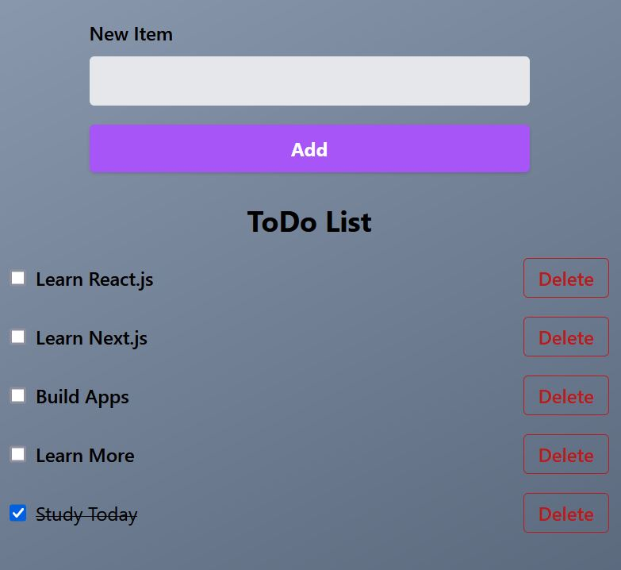

<h1 align="center">React ToDo List YT Tutorial | NickOD.xyz</h1>

 

## Overview

This is my first react web app. For now it is all in one .jsx file. Moving forward my apps will be created as seperate functional components in seperate files.

[Web Dev Simplified YT Tutorial](https://www.youtube.com/watch?v=Rh3tobg7hEo&t=449s)

 

## Link to Live Site of Notes

[Coming Soon]()

 

## Sticking Points & What I learned

useState & useEffect

- I got a feeling for useStates. Going through a tutorial really helped me to get a grasped on why and where they would be used. More so and added to the Codecademy course concepts I've been learning.

Props

- While this tutorial did in the end refactor the code into seperate components and files. I didn't feel it explained well or helped in my understanding of using / adding props. Whilst I could have just copied the code and given a complete and seperate codebase, I really didn't see a point as it would have been more or a copy and paste tutorial. Rather than applying what I have already learned and have an understanding on.

- So realise now that I need to go over props some more and get a clearer picture of why and when I would need to use them.

## Author

- Website - [NickOD.xyz](http://www.NickOD.xyz)
- My LinkedIn - [LinkedIn](https://www.linkedin.com/in/nick-odonoghue/)

 

## Useful Resources

[Codecademy - React Hooks Cheatsheet](https://www.codecademy.com/learn/learn-react-hooks/modules/learn-react-hooks/cheatsheet)

 

## Acknowledgments

[Le Wagon](https://www.lewagon.com/) & all the teachers, TAs and classmates from <em>1122</em>

[Web Dev Simplified YT](https://www.youtube.com/@WebDevSimplified)
[Web Dev Simplified](https://courses.webdevsimplified.com/)
